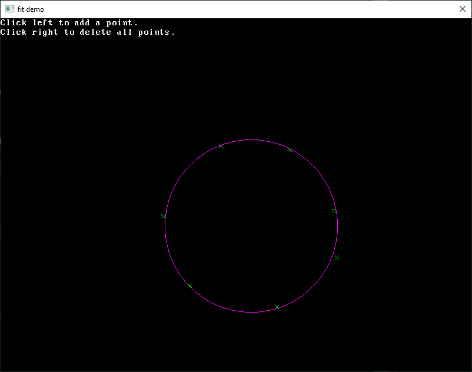

Package fit implements fitting of circles to points. See the [online documentation](https://pkg.go.dev/github.com/gonutz/fit) for the API.

There is a demo to try the algorithm in the `demo` folder.

